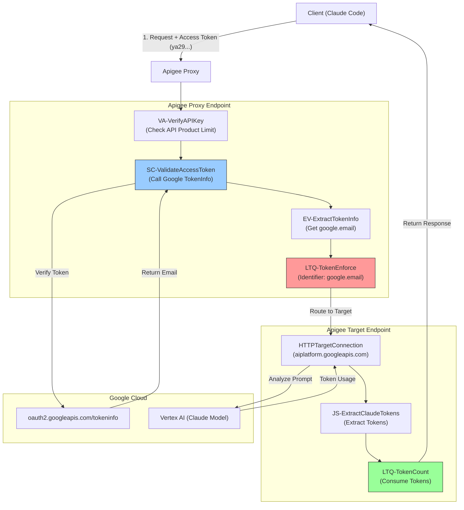

# Apigee LLM User-Based Token Quota Sample

This proxy demonstrates how to implement **User-Based LLM Token Quota** enforcement using Apigee. It intercepts requests to Anthropic Claude (via Vertex AI), calculates token usage, and enforces limits per user email.

## 🔑 Key Features

1.  **Shared API Key, Individual Quota**:
    *   A single API Key can be shared among hundreds of users.
    *   Quota is enforced based on the **User Email** extracted from the Google Access Token provider by the client (e.g., `claude-code`).
    *   One user exceeding their quota **does not** affect others.

2.  **Two-Stage Quota Enforcement**:
    *   **EnforceOnly (`LTQ-TokenEnforce`)**: Checks quota *before* the request reaches the LLM. Using "common-counter" bucketed by Email.
    *   **CountOnly (`LTQ-TokenCount`)**: Consumes quota *after* the request, based on actual token usage returned by the LLM.

3.  **Secure Authentication**:
    *   Validates Google Access Tokens via `oauth2.googleapis.com/tokeninfo`.
    *   Passes through the client's Google Access Token (user credentials) to Vertex AI, enabling GCP-level auditing and dynamic billing labels.

4.  **Security & Performance Hardening**:
    *   **OAuth Token Caching**: Caches token validation mappings for 300 seconds to minimize external API call latency and prevent hitting Google API rate limits.
    *   **SSRF Protection**: Performs strict regex validation on dynamic regional target locations to prevent host header injection.
    *   **JSON Threat Protection**: Enforces structural payload constraints (depth, array/string sizes) to block Denial-of-Service (DoS) attacks.
    *   **Streaming (SSE) Support**: Supports Server-Sent Events (SSE) responses via Apigee `EventFlow` response chunk processing, correctly tracking cumulative token usage for clients like `claude-code` that utilize streaming.
    *   **Decompression Error Prevention**: Strips the client's `Accept-Encoding` header when forwarding requests to Vertex AI, preventing client-side `ZlibError` or decompression mismatches during streaming responses.

## 🏗️ Architecture Flow



## 🛠️ Configuration Details

### Quota Logic
The user isolation is achieved through the `<Identifier>` element in the Quota policies:

```xml
<LLMTokenQuota name="LTQ-TokenEnforce" type="calendar">
    <!-- Default count is 10000, but dynamically overridden by API Product configuration if present -->
    <Allow count="10000" countRef="verifyapikey.VA-VerifyAPIKey.apiproduct.developer.llmQuota.limit"/>
    <Interval ref="verifyapikey.VA-VerifyAPIKey.apiproduct.developer.llmQuota.interval">1</Interval>
    <TimeUnit ref="verifyapikey.VA-VerifyAPIKey.apiproduct.developer.llmQuota.timeunit">minute</TimeUnit>
    
    <!-- Unique counter identifier per user email -->
    <Identifier ref="google.email"/>
    <StartTime>2013-08-21 10:00:00</StartTime>
    <LLMModelSource>{model}</LLMModelSource>
    <EnforceOnly>true</EnforceOnly>
    <SharedName>common-counter</SharedName>
</LLMTokenQuota>
```

- **Limit**: Defined in the API Product (e.g., 1000 tokens/min).
- **Identifier**: `google.email` (extracted from Access Token).
- **Result**: Every unique email gets its own bucket of 1000 tokens.

## 📋 Prerequisites

### Apigee Environment & Network (Provision via Terraform)
Before deploying, the Apigee environment must be provisioned and accessible. We provide an automated Terraform configuration under the [`terraform/`](file:///usr/local/google/home/sinjoongk/Documents/sinjoonk/apigee-llm-token-quota/terraform) directory to set up:
1. Apigee Organization (Non-VPC Peered, PAYG) and Instance.
2. Apigee Environment, Env Group, and Attachments.
3. KMS encryption keys for DB & Instance disks.
4. Google-managed SSL Certificate & External HTTPS Load Balancer with Private Service Connect (PSC) NEG.
5. Cloud DNS zone mapping records.
6. Service accounts & IAM role assignments (`roles/iam.serviceAccountTokenCreator`, `roles/aiplatform.user`).

To provision the infrastructure using Terraform, check the [**`terraform/README.md`**](file:///usr/local/google/home/sinjoongk/Documents/sinjoonk/apigee-llm-token-quota/terraform/README.md) file for step-by-step instructions.


### IAM Permissions Configuration

#### 1. Proxy Service Account Permissions
The Service Account used by the Proxy (`apigee-demo`) must have the **Agent Platform User** (formerly Vertex AI User) role (`roles/aiplatform.user`) to invoke the Gemini/Claude API.

```bash
gcloud projects add-iam-policy-binding YOUR_PROJECT_ID \
  --member="serviceAccount:YOUR_SERVICE_ACCOUNT" \
  --role="roles/aiplatform.user"
```

#### 2. Test User Account Permissions (For Claude Code & Test Clients)
To perform testing successfully, the **actual Google User Account** executing the tests must also be granted the following IAM roles:

*   **Agent Platform User** (`roles/aiplatform.user`): Required to invoke Claude models via proxy.
*   **Apigee Read-only Admin** (`roles/apigee.readOnlyAdmin`): Required to retrieve app credentials/API keys dynamically (e.g. inside `./test-quota.sh`). Note that the default `Apigee API Reader` role is insufficient as it does not allow reading app keys.

```bash
# Bind Apigee Read-only Admin role to retrieve keys
gcloud projects add-iam-policy-binding YOUR_PROJECT_ID \
  --member="user:user@domain.com" \
  --role="roles/apigee.readOnlyAdmin"

# Bind Agent Platform User role to call Claude
gcloud projects add-iam-policy-binding YOUR_PROJECT_ID \
  --member="user:user@domain.com" \
  --role="roles/aiplatform.user"
```

### Vertex AI Model Enablement
To use Claude models, you must enable them in the **Vertex AI Model Garden**.
Specifically, ensure the following models are enabled in your Google Cloud project (`YOUR_PROJECT_ID`):
- **Claude Opus 4.8** (or `claude-opus-4-8`)
- **Claude Sonnet 4.6** (or `claude-sonnet-4-6`)
- **Claude Haiku 4.5** (or `claude-haiku-4-5`)

Visit [Vertex AI Model Garden](https://console.cloud.google.com/vertex-ai/model-garden) and search for "Claude" to enable them.

## 🚀 Deployment

Use the provided custom script to deploy to your environment.

```bash
# 1. Create and configure environment variables
cp set-env.sh.example set-env.sh
vi set-env.sh  # Update with your values
source ./set-env.sh

# 2. Deploy
./deploy-llm-token-limits-v2.sh
```

## 🤖 Automated Quota Testing

You can use the provided `test-quota.sh` script to verify the quota enforcement by sending multiple complex prompts.

```bash
# Set your API Key (Bronze or Silver)
export API_KEY="YOUR_API_KEY"
export APIGEE_HOST="YOUR_APIGEE_HOST"

# Run 20 requests (default)
./test-quota.sh 20
```

## 📊 GCP Logging & Monitoring Dashboard

The Apigee proxy automatically outputs detailed JSON logs to Google Cloud Logging under the log name `apigee-llm-token-quota` for every request processed (both successful and failed, including 429 quota exceed responses) inside the `PostClientFlow`.

These logs are compiled into metrics and displayed on a unified GCP Monitoring Dashboard provisioned automatically via Terraform:

### 📈 Dashboard Charts:
1.  **LLM Token Usage Trend by User (Total)**: Line chart showing total cumulative token consumption grouped by `user_email` to help visualize usage distribution.
2.  **Token Consumption by Claude Model**: Line chart demonstrating token usage trends separated by Claude model versions (e.g. `claude-sonnet-4-6`, `claude-haiku-4-5`).
3.  **Token Consumption by Apigee API Product**: Stacked area chart showing total tokens consumed per Apigee API Product tier (`bronze`, `silver`, etc.).
4.  **Request Count by Response Code**: Stacked bar chart visualizing the frequency of HTTP response status codes (e.g. `200` OK, `429` Quota Exceeded) mapped to help monitor error rates. Tooltips show clean, single-count aggregates via automatic dynamic alignment period adjustment.
5.  **Top 10 Token Consuming Users**: Time Series Table widget showing a list of the top 10 user email addresses (`user_email`) who have consumed the largest amount of tokens, along with their precise total token usage numbers.

---

## 🏷️ GCP Billing Labels (Vertex AI)

To support organizational cost-center tracking directly within the Google Cloud Billing console, the proxy automatically attaches custom tracking labels to all outgoing Vertex AI requests.

*   **HTTP Header**: `X-Vertex-AI-Labels`
*   **Format**: Base64-encoded JSON payload containing:
    ```json
    {
      "claude_requester": "sanitized_user_email"
    }
    ```
*   **Sanitization**: User emails are automatically converted to lowercase, with special characters replaced by underscores, and truncated to 63 characters to meet GCP billing constraints (e.g., `user@domain.com` becomes `user_domain_com`).
*   **Billing Reports Latency**: Please note that new custom labels can take **24 to 48 hours** to propagate and appear as filter options under the "Labels" section in the Google Cloud Billing Console Reports due to asynchronous billing pipeline processing.

---

## 🧪 Testing with Claude Code

### 1. Authenticate with Google Cloud (Mandatory)
Before launching Claude Code, you must authenticate your local environment using Application Default Credentials (ADC):

```bash
gcloud auth application-default login
```

**Why is this required?**
*   **Access Token Generation**: The `claude` CLI client uses local Google Application Default Credentials to dynamically generate a Google Access Token, which it passes in the `Authorization: Bearer <TOKEN>` header of every API request.
*   **User Identity Quota Isolation**: The Apigee proxy intercepts this token, validates it against Google OAuth2 token info service, extracts your user email, and uses it as the unique quota identifier (`google.email`). Without a valid ADC token, Apigee cannot authenticate your user identity and will reject the request.
*   **Target Authorization (Pass-through)**: The proxy forwards this token directly to Vertex AI. Ensure your Google account has the **Agent Platform User** (formerly Vertex AI User) role (`roles/aiplatform.user`) in the GCP project, or the API call will return a 403 Forbidden error.

### 2. Configure Claude Code Settings
Ensure your `~/.claude/settings.json` is configured to route calls via your Apigee proxy:

```json
{
  "env": {
    "CLAUDE_CODE_USE_VERTEX": "1",
    "ANTHROPIC_VERTEX_PROJECT_ID": "YOUR_PROJECT_ID",
    "ANTHROPIC_VERTEX_BASE_URL": "https://YOUR_APIGEE_HOST/v2/samples/llm-token-limits/v1",
    "ANTHROPIC_CUSTOM_HEADERS": "x-apikey: YOUR_API_KEY",
    "ANTHROPIC_MODEL": "claude-sonnet-4-6",          // Can also be set to "claude-opus-4-8"
    "ANTHROPIC_SMALL_FAST_MODEL": "claude-haiku-4-5",
    "CLOUD_ML_REGION": "global"                      // Routes via regional dynamic routing in Apigee
  }
}
```


## 🧹 Cleanup

To remove the deployed resources (Proxies, Products, Apps) *without* deleting the Apigee Environment:

```bash
# Variables must match deployment
export PROJECT="YOUR_PROJECT_ID"
export APIGEE_ENV="YOUR_ENV"

./undeploy-llm-token-limits-v2.sh
```

---
✨ This codebase was built with the help of <a href="https://antigravity.google/" target="_blank">Google Antigravity</a>! 🚀
