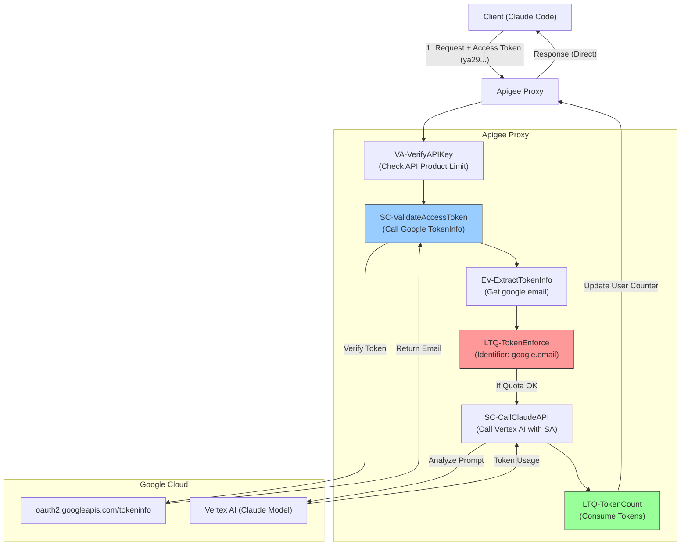

# Apigee LLM User-Based Token Quota Sample

This proxy demonstrates how to implement **User-Based LLM Token Quota** enforcement using Apigee. It intercepts requests to Anthropic Claude (via Vertex AI), calculates token usage, and enforces limits per user email.

## 🔑 Key Features

1.  **Shared API Key, Individual Quota**:
    *   A single API Key can be shared among hundreds of users.
    *   Quota is enforced based on the **User Email** extracted from the Google Access Token provider by the client (e.g., `claude-code`).
    *   One user exceeding their quota **does not** affect others.

2.  **Two-Stage Quota Enforcement**:
    *   **EnforceOnly (`LTQ-TokenEnforce`)**: Checks quota *before* the request reaches the LLM. Using "common-counter" bucketed by Email.
    *   **CountOnly (`LTQ-TokenCount`)**: Consumes quota *after* the request, based on actual token usage returned by the LLM.

3.  **Secure Authentication**:
    *   Validates Google Access Tokens via `oauth2.googleapis.com/tokeninfo`.
    *   Uses Apigee Service Account (`apigee-demo`) to securely invoke Vertex AI, removing the need for client-side keys.

## 🏗️ Architecture Flow



## 🛠️ Configuration Details

### Quota Logic
The user isolation is achieved through the `<Identifier>` element in the Quota policies:

```xml
<LLMTokenQuota name="LTQ-TokenEnforce">
    <!-- Limit is shared from API Product settings -->
    <Allow count="1000" countRef="verifyapikey.VA-VerifyAPIKey.apiproduct.developer.llmQuota.limit"/>
    
    <!-- BUT the counter is unique per Email -->
    <Identifier ref="google.email"/>
    
    <EnforceOnly>true</EnforceOnly>
</LLMTokenQuota>
```

- **Limit**: Defined in the API Product (e.g., 1000 tokens/min).
- **Identifier**: `google.email` (extracted from Access Token).
- **Result**: Every unique email gets its own bucket of 1000 tokens.

## 📋 Prerequisites

### Apigee Environment & Network
Before deploying, ensure your Apigee environment is provisioned and accessible. This includes setting up the **Load Balancer**, **Private Service Connect (PSC)**, and **DNS** entries to route traffic to your Apigee Runtime.

*   Reference: [Apigee Provisioning - External Routing with PSC](https://docs.cloud.google.com/apigee/docs/api-platform/get-started/install-cli-non-peered?hl=en#external-routing-psc)


### Service Account Permissions
The Service Account used by the Proxy (`apigee-demo`) must have the **Vertex AI User** role (`roles/aiplatform.user`) to invoke the Gemini/Claude API.

```bash
gcloud projects add-iam-policy-binding "dm-project-391900" \
  --member="serviceAccount:YOUR_SERVICE_ACCOUNT" \
  --role="roles/aiplatform.user"
```

### Vertex AI Model Enablement
To use Claude models, you must enable them in the **Vertex AI Model Garden**.
Specifically, ensure the following models are enabled in your project (`YOUR_PROJECT_ID`):
- **Claude 3.5 Sonnet** (or `sonnet-4-5` if available)
- **Claude 3.5 Haiku** (or `haiku-4-5`)

Visit [Vertex AI Model Garden](https://console.cloud.google.com/vertex-ai/model-garden) and search for "Claude" to enable them.

## 🚀 Deployment

Use the provided custom script to deploy to your environment.

```bash
# Update these variables in the script if needed
export PROJECT="YOUR_PROJECT_ID"
export APIGEE_ENV="YOUR_ENV"
export SERVICE_ACCOUNT="YOUR_SERVICE_ACCOUNT"

./deploy-llm-token-limits-v2.sh
```

## 🧪 Testing with Claude Code

Ensure your `~/.claude/settings.json` is configured to use Vertex AI. The client will automatically send the Google Access Token.

```json
{
  "env": {
    "CLAUDE_CODE_USE_VERTEX": "1",
    "ANTHROPIC_VERTEX_PROJECT_ID": "YOUR_PROJECT_ID",
    "ANTHROPIC_VERTEX_BASE_URL": "https://YOUR_APIGEE_HOST/v2/samples/llm-token-limits/v1",
    "ANTHROPIC_CUSTOM_HEADERS": "x-apikey: YOUR_API_KEY"
  }
}
```


## 🧹 Cleanup

To remove the deployed resources (Proxies, Products, Apps) *without* deleting the Apigee Environment:

```bash
# Variables must match deployment
export PROJECT="YOUR_PROJECT_ID"
export APIGEE_ENV="YOUR_ENV"

./undeploy-llm-token-limits-v2.sh
```

---
✨ This codebase was built with the help of <a href="https://antigravity.google/" target="_blank">Google Antigravity</a>! 🚀
