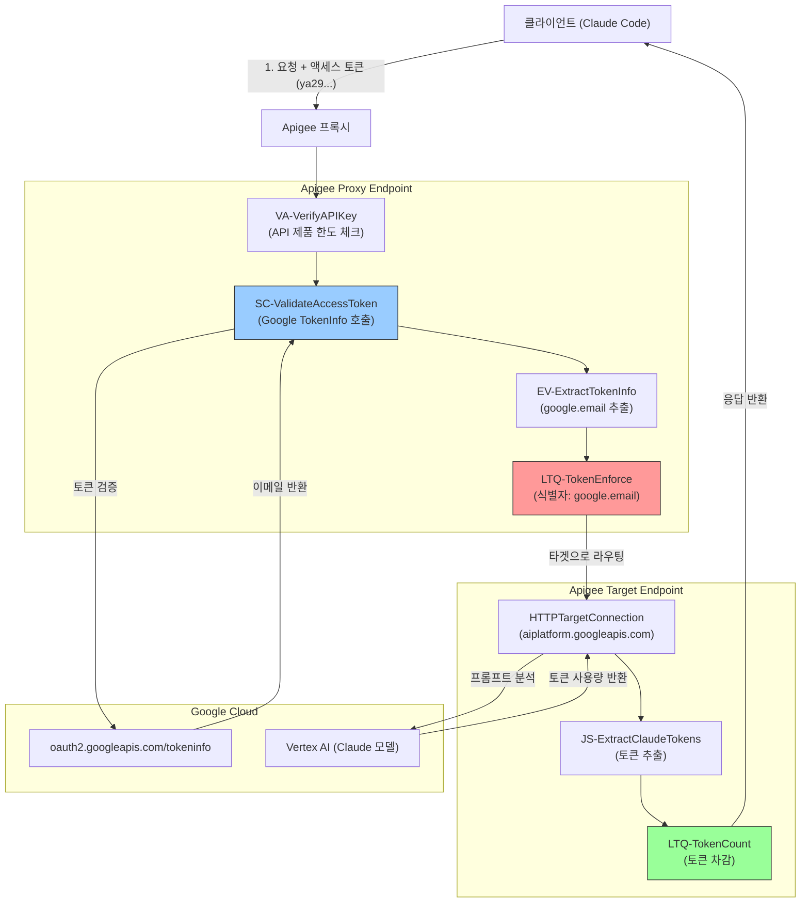

# Apigee LLM 사용자 기반 토큰 쿼타 샘플

이 프록시는 Apigee를 사용하여 **사용자 기반 LLM 토큰 쿼타(User-Based LLM Token Quota)** 제한을 구현하는 방법을 보여줍니다. Anthropic Claude (Vertex AI를 경유)로 들어오는 요청을 가로채고, 토큰 사용량을 계산하며, 사용자 이메일별로 사용량 한도를 적용합니다.

## 🔑 주요 특징

1.  **공유 API 키, 개별 쿼타 (Shared API Key, Individual Quota)**:
    *   하나의 API 키를 수백 명의 사용자가 공유하여 사용할 수 있습니다.
    *   클라이언트(예: `claude-code`)가 제공하는 Google 액세스 토큰에서 추출한 **사용자 이메일(User Email)**을 기반으로 쿼타를 적용합니다.
    *   특정 사용자가 쿼타를 초과하더라도 다른 사용자에게 영향을 주지 않습니다.

2.  **2단계 쿼타 제한 적용 (Two-Stage Quota Enforcement)**:
    *   **EnforceOnly (`LTQ-TokenEnforce`)**: 요청이 LLM에 전달되기 *전*에 쿼타를 확인합니다. 이메일별로 구성된 "공동 카운터(common-counter)"를 사용합니다.
    *   **CountOnly (`LTQ-TokenCount`)**: 요청이 처리된 *후*에 LLM이 반환한 실제 토큰 사용량에 따라 쿼타를 차감합니다.

3.  **보안 인증 (Secure Authentication)**:
    *   `oauth2.googleapis.com/tokeninfo`를 통해 Google 액세스 토큰을 검증합니다.
    *   클라이언트의 Google 액세스 토큰(사용자 인증 정보)을 Vertex AI로 직접 전달(Pass-through)하여 호출하며, 이를 통해 GCP 레벨에서의 개별 감사 및 동적 빌링 레이블 지정을 지원합니다.

4.  **보안 및 성능 강화 (Security & Performance Hardening)**:
    *   **OAuth 토큰 캐싱**: 토큰 검증 결과를 300초 동안 캐싱하여 외부 API 호출 지연(Latency)을 단축하고 Google API 호출 속도 제한(Rate limits) 초과를 방지합니다.
    *   **SSRF 방지**: 동적 리전별 백엔드 라우팅 시 엄격한 정규식 검증을 적용하여 호스트 헤더 변조 및 비정상 접근을 차단합니다.
    *   **JSON Threat Protection**: 페이로드 구조 제약 조건(중첩 깊이, 배열 크기 등)을 강제하여 서비스 거부(DoS) 공격을 방어합니다.
    *   **스트리밍(SSE) 지원**: Apigee `EventFlow` 응답 청크 처리를 통해 Server-Sent Events(SSE) 스트리밍 응답을 지원하며, `claude-code`와 같은 스트리밍 클라이언트 호출 시에도 누적 토큰 사용량을 정상 수집 및 차감합니다.
    *   **압축 에러 방지**: Vertex AI 백엔드로 요청을 전달할 때 클라이언트의 `Accept-Encoding` 헤더를 제거(Strip)하여, 스트리밍 응답 도중 발생할 수 있는 클라이언트 단의 `ZlibError` 또는 압축 해제 불일치 현상을 방지합니다.

## 🏗️ 아키텍처 흐름



## 🛠️ 구성 상세

### 쿼타 로직
사용자 격리는 Quota 정책의 `<Identifier>` 요소를 통해 구현됩니다:

```xml
<LLMTokenQuota name="LTQ-TokenEnforce" type="calendar">
    <!-- 기본 제한량은 10000이며, API Product 설정에 값이 지정되어 있을 경우 동적으로 재정의됩니다 -->
    <Allow count="10000" countRef="verifyapikey.VA-VerifyAPIKey.apiproduct.developer.llmQuota.limit"/>
    <Interval ref="verifyapikey.VA-VerifyAPIKey.apiproduct.developer.llmQuota.interval">1</Interval>
    <TimeUnit ref="verifyapikey.VA-VerifyAPIKey.apiproduct.developer.llmQuota.timeunit">minute</TimeUnit>
    
    <!-- 사용자 이메일별 고유 카운터 식별자 -->
    <Identifier ref="google.email"/>
    <StartTime>2013-08-21 10:00:00</StartTime>
    <LLMModelSource>{model}</LLMModelSource>
    <EnforceOnly>true</EnforceOnly>
    <SharedName>common-counter</SharedName>
</LLMTokenQuota>
```

-   **한도 (Limit)**: API Product 설정에서 정의됩니다 (예: 분당 1,000 토큰).
-   **식별자 (Identifier)**: `google.email` (액세스 토큰에서 추출).
-   **결과**: 고유한 이메일별로 각각 1,000 토큰의 사용 한도가 할당됩니다.

## 📋 사전 요구사항

### Apigee 환경 및 네트워크 (Terraform 배포)
배포를 시작하기 전에 Apigee 환경이 프로비저닝되고 접근 가능한 상태여야 합니다. 이를 위한 자동화된 Terraform 구성을 [`terraform/`](file:///usr/local/google/home/sinjoongk/Documents/sinjoonk/apigee-llm-token-quota/terraform) 디렉토리에 제공합니다:
1.  Apigee 조직 (VPC 피어링 미사용, PAYG) 및 인스턴스.
2.  Apigee 환경, 환경 그룹 및 연결(Attachment).
3.  DB 및 인스턴스 디스크 암호화용 KMS 키.
4.  Google 관리형 SSL 인증서 및 Private Service Connect (PSC) NEG 기반 전역 외부 HTTPS 부하 분산기.
5.  Cloud DNS zone 매핑 레코드.
6.  서비스 계정 및 IAM 역할 지정 (`roles/iam.serviceAccountTokenCreator`, `roles/aiplatform.user`).

Terraform을 사용해 인프라를 구축하려면 [**`terraform/README.md`**](file:///usr/local/google/home/sinjoongk/Documents/sinjoonk/apigee-llm-token-quota/terraform/README.md) 파일의 단계별 안내를 참조해 주세요.


### 서비스 계정 권한
프록시에서 사용하는 서비스 계정(`apigee-demo`)은 Gemini/Claude API를 호출하기 위해 **Vertex AI 사용자** 역할(`roles/aiplatform.user`)을 가지고 있어야 합니다.

```bash
gcloud projects add-iam-policy-binding YOUR_PROJECT_ID \
  --member="serviceAccount:YOUR_SERVICE_ACCOUNT" \
  --role="roles/aiplatform.user"
```

### Vertex AI Model 활성화
Claude 모델을 사용하려면 **Vertex AI Model Garden**에서 해당 모델들이 활성화되어 있어야 합니다.
특히, Google Cloud 프로젝트(`YOUR_PROJECT_ID`)에 다음 모델들이 활성화되었는지 확인하세요:
-   **Claude Opus 4.8** (또는 `claude-opus-4-8`)
-   **Claude Sonnet 4.6** (또는 `claude-sonnet-4-6`)
-   **Claude Haiku 4.5** (또는 `claude-haiku-4-5`)

[Vertex AI Model Garden](https://console.cloud.google.com/vertex-ai/model-garden)에 방문하여 "Claude"를 검색한 뒤 모델을 활성화합니다.

## 🚀 배포

제공된 커스텀 스크립트를 사용하여 환경에 배포합니다.

```bash
# 1. 환경 변수 파일 생성 및 수정
cp set-env.sh.example set-env.sh
vi set-env.sh  # 환경 설정 값 입력
source ./set-env.sh

# 2. 배포 스크립트 실행
./deploy-llm-token-limits-v2.sh
```

## 🤖 자동화된 쿼타 테스트

여러 개의 복잡한 프롬프트를 전송하여 쿼타 제한 정책을 검증하는 `test-quota.sh` 스크립트를 실행할 수 있습니다.

```bash
# API 키 지정 (Bronze 혹은 Silver)
export API_KEY="YOUR_API_KEY"
export APIGEE_HOST="YOUR_APIGEE_HOST"

# 20회 요청 전송 (기본값)
./test-quota.sh 20
```

## 📊 GCP Logging & 대시보드 모니터링

Apigee 프록시는 요청이 처리될 때마다(성공 요청 및 429 쿼타 초과 실패 요청 모두 포함) `PostClientFlow` 단에서 `apigee-llm-token-quota` 라는 로그 이름으로 구글 클라우드 로깅(Cloud Logging)에 상세 JSON 로그를 전송합니다.

수집된 로그들은 로그 기반 메트릭으로 자동 변환되며, Terraform으로 함께 배포되는 전용 GCP Monitoring Dashboard 상에 시각화됩니다.

### 📈 제공되는 차트:
1.  **사용자별 LLM 토큰 사용량 트렌드 (합계)**: 누적 토큰 소비 현황을 사용자 이메일(`user_email`) 기준으로 분류하여 라인 차트(Line Chart) 형태로 시각화합니다.
2.  **Claude 모델별 토큰 소비량**: Claude 모델 종류(`model`, 예: `claude-sonnet-4-6`, `claude-haiku-4-5`)에 따른 실시간 토큰 사용 현황을 라인 차트로 보여줍니다.
3.  **Apigee API 제품별 토큰 소비량**: API 제품 등급(`api_product`, 예: `bronze`, `silver` 등) 기준 누적 사용 트렌드를 적층 영역(Stacked Area) 차트로 보여줍니다.
4.  **응답 코드별 요청 수**: API 요청 성공(`200`) 및 쿼타 제한 초과(`429`) 등의 HTTP 상태 코드 빈도를 분류하여 시각화합니다. 차트의 시간 축 해상도 조절에 맞춰 툴팁에는 항상 단일 카운트 건수(Count)만 깔끔하게 노출됩니다.
5.  **토큰 다소비 유저 TOP 10**: 가장 많은 토큰을 사용한 상위 10명의 이메일 주소(`user_email`) 리스트와 각각의 누적 토큰 소비량을 표(Table) 형태로 대시보드상에 직접 출력해 줍니다.

---

## 🏷️ GCP Billing 레이블 연동 (Vertex AI 비용 추적)

조직 내 비용 센터별 부서 청구 또는 사용자별 실질 비용 구분을 지원하기 위해, 프록시는 Vertex AI로 향하는 모든 API 요청에 커스텀 비용 추적 레이블을 헤더에 삽입합니다.

*   **HTTP 헤더 키**: `X-Vertex-AI-Labels`
*   **라벨 구조 및 포맷**: 아래 구조의 JSON 데이터를 **Base64로 인코딩**하여 전달합니다.
    ```json
    {
      "claude_requester": "정제된_사용자_이메일"
    }
    ```
*   **값 정제 규칙(Sanitization)**: 사용자 이메일 값은 소문자로 변환되고 특수 기호는 언더바(`_`)로 치환되며, GCP 레이블 제약 조건에 맞춰 최대 63글자 이내로 정제됩니다 (예: `user@domain.com` ➡️ `user_domain_com`).
*   **빌링 보고서 반영 지연 주의**: 새롭게 주입된 레이블 데이터는 구글 클라우드 빌링(GCP Billing) 파이프라인의 배치 처리 특성상, 실제 호출 후 **약 24시간에서 48시간이 지난 후에** GCP Billing Console 보고서의 필터 선택란(`Labels` -> `Select a key`)에 조회가 가능해집니다.

---

## 🧪 Claude Code 연동 테스트

### 1. Google Cloud 인증 (필수)
Claude Code를 실행하기 전에 아래 명령어로 로컬 환경을 Application Default Credentials (ADC)로 인증해야 합니다:

```bash
gcloud auth application-default login
```

**이 작업이 왜 필요한가요?**
*   **액세스 토큰 생성**: `claude` CLI 클라이언트는 로컬의 Google Application Default Credentials를 활용해 Google 액세스 토큰을 동적으로 생성하고, 매 API 요청마다 `Authorization: Bearer <TOKEN>` 헤더에 실어 전송합니다.
*   **사용자 신원 기반 쿼타 격리**: Apigee 프록시는 이 토큰을 가로채 Google OAuth2 토큰 정보 서비스를 통해 검증하고 사용자의 이메일을 추출하여 고유 쿼타 식별자(`google.email`)로 활용합니다. 유효한 ADC 토큰이 없으면 Apigee가 사용자 신원을 검증할 수 없어 요청이 거부됩니다.
*   **타겟 권한 전달 (Pass-through)**: 프록시는 이 토큰을 Vertex AI로 그대로 전달합니다. 로컬 인증에 사용하는 Google 계정이 GCP 프로젝트 내에서 **Vertex AI 사용자**(`roles/aiplatform.user`) 역할을 가지고 있어야 하며, 그렇지 않을 경우 API 호출 시 403 Forbidden 오류가 발생합니다.

### 2. Claude Code 설정 구성
`~/.claude/settings.json` 파일이 Apigee 프록시를 통해 요청을 라우팅하도록 설정되어 있는지 확인합니다:

```json
{
  "env": {
    "CLAUDE_CODE_USE_VERTEX": "1",
    "ANTHROPIC_VERTEX_PROJECT_ID": "YOUR_PROJECT_ID",
    "ANTHROPIC_VERTEX_BASE_URL": "https://YOUR_APIGEE_HOST/v2/samples/llm-token-limits/v1",
    "ANTHROPIC_CUSTOM_HEADERS": "x-apikey: YOUR_API_KEY",
    "ANTHROPIC_MODEL": "claude-sonnet-4-6",          // "claude-opus-4-8" 등으로도 설정 가능
    "ANTHROPIC_SMALL_FAST_MODEL": "claude-haiku-4-5",
    "CLOUD_ML_REGION": "global"                      // Apigee에서 제공하는 리전별 동적 라우팅을 타게 됩니다
  }
}
```


## 🧹 리소스 삭제

Apigee 환경 자체를 삭제하지 않고 배포된 프록시, 제품, 앱 리소스만 제거하려면:

```bash
# 배포했던 변수와 일치시킵니다
export PROJECT="YOUR_PROJECT_ID"
export APIGEE_ENV="YOUR_ENV"

./undeploy-llm-token-limits-v2.sh
```

---
✨ 이 코드베이스는 <a href="https://antigravity.google/" target="_blank">Google Antigravity</a>의 도움으로 빌드되었습니다! 🚀
