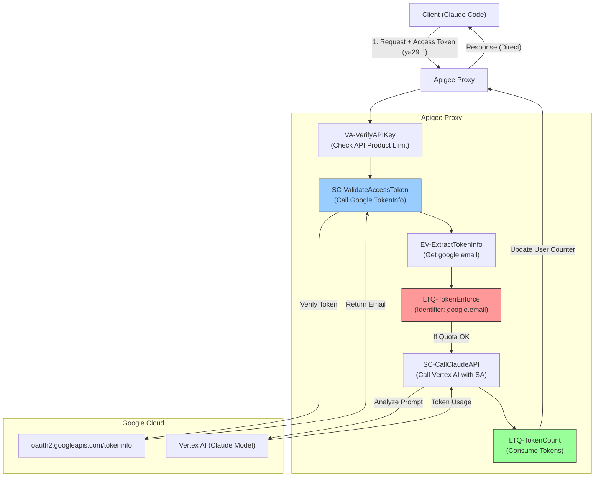

# Apigee LLM 사용자별 Token Quota 예제

이 프록시는 Apigee를 사용하여 **사용자별 LLM Token Quota**를 적용하는 방법을 보여줍니다. Anthropic Claude(Vertex AI 경유)로 가는 요청을 가로채서 토큰 사용량을 계산하고, 사용자 이메일별로 제한을 적용합니다.

## 🔑 주요 기능

1.  **API Key 공유, Quota는 개별 적용**:
    *   하나의 API Key를 수백 명의 사용자가 공유할 수 있습니다.
    *   Quota는 클라이언트(예: `claude-code`)가 제공한 Google Access Token에서 추출한 **사용자 이메일**을 기준으로 적용됩니다.
    *   특정 사용자가 Quota를 초과해도 다른 사용자에게는 **영향을 주지 않습니다**.

2.  **2단계 Quota 적용 (Two-Stage Enforcement)**:
    *   **EnforceOnly (`LTQ-TokenEnforce`)**: 요청이 LLM에 도달하기 *전에* Quota를 확인합니다. 이메일별로 버킷화된 "common-counter"를 사용합니다.
    *   **CountOnly (`LTQ-TokenCount`)**: 요청 처리 *후*, LLM이 반환한 실제 토큰 사용량을 기반으로 Quota를 차감합니다.

3.  **안전한 인증 (Secure Authentication)**:
    *   `oauth2.googleapis.com/tokeninfo`를 통해 Google Access Token을 검증합니다.
    *   Apigee Service Account (`apigee-demo`)를 사용하여 Vertex AI를 안전하게 호출하므로, 클라이언트 측에 별도 키를 저장할 필요가 없습니다.

## 🏗️ 아키텍처 흐름



## 🛠️ 설정 상세

### Quota 로직
Quota 정책의 `<Identifier>` 요소를 통해 사용자 격리를 구현합니다:

```xml
<LLMTokenQuota name="LTQ-TokenEnforce">
    <!-- 한도(Limit)는 API Product 설정 값을 공유합니다 -->
    <Allow count="1000" countRef="verifyapikey.VA-VerifyAPIKey.apiproduct.developer.llmQuota.limit"/>
    
    <!-- 하지만 카운터(Counter)는 이메일별로 생성됩니다 -->
    <Identifier ref="google.email"/>
    
    <EnforceOnly>true</EnforceOnly>
</LLMTokenQuota>
```

- **Limit**: API Product에 정의됨 (예: 1000 tokens/min).
- **Identifier**: `google.email` (Access Token에서 추출).
- **Result**: 고유한 이메일마다 각각 1000 토큰의 버킷을 가집니다.

## � 사전 요구사항

### Service Account 권한 설정
프록시에서 사용하는 Service Account (`apigee-demo`)는 Gemini/Claude API를 호출하기 위해 **Vertex AI User** (`roles/aiplatform.user`) 권한이 필요합니다.

```bash
gcloud projects add-iam-policy-binding "YOUR_PROJECT_ID" \
  --member="serviceAccount:YOUR_SERVICE_ACCOUNT" \
  --role="roles/aiplatform.user"
```

## �🚀 배포 방법

제공된 커스텀 스크립트를 사용하여 환경에 배포하세요.

```bash
# 필요 시 스크립트 내 변수 수정
export PROJECT="YOUR_PROJECT_ID"
export APIGEE_ENV="YOUR_ENV"
export SERVICE_ACCOUNT="YOUR_SERVICE_ACCOUNT"

./deploy-custom.sh
```

## 🧪 Claude Code 테스트

`~/.claude/settings.json` 파일이 Vertex AI를 사용하도록 설정되어 있는지 확인하세요. 클라이언트는 자동으로 Google Access Token을 전송합니다.

```json
{
  "env": {
    "CLAUDE_CODE_USE_VERTEX": "1",
    "ANTHROPIC_VERTEX_PROJECT_ID": "YOUR_PROJECT_ID",
    "ANTHROPIC_VERTEX_BASE_URL": "https://YOUR_APIGEE_HOST/v2/samples/llm-token-limits/v1",
    "ANTHROPIC_CUSTOM_HEADERS": "x-apikey: YOUR_API_KEY"
  }
}
```


---
✨ This codebase was built with the help of [Google Antigravity](https://labs.google.com/antigravity)! 🚀
